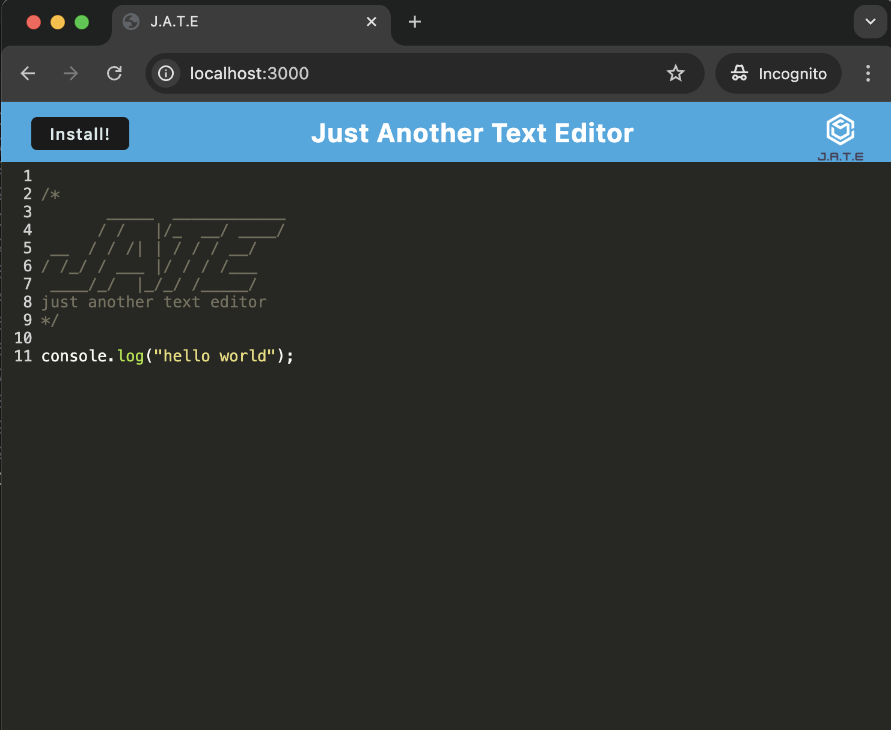

# Just Another Text Editor (J.A.T.E)
Just Another Text Editor (J.A.T.E) is a Progressive Web App (PWA) that allows you to edit and save text files offline. It features a clean, intuitive interface and supports installation on your device for a native-like experience.
## Features
* Offline Editing: Save and edit text files even when you are offline.
* Installable: Install the app on your device for a full-screen experience.
* Service Worker: Utilizes a service worker for offline support and caching.
* Progressive Web App: Provides a native-like experience with PWA capabilities.
## Technologies Used
* HTML/CSS/JavaScript: For building the front-end interface and functionality.
* Webpack: For bundling JavaScript files and managing assets.
* Workbox: For service worker management and offline caching.
* Babel: For JavaScript transpilation.
* Concurrently: For running backend and client scripts simultaneously.
## Installation
### Prerequisites
Ensure you have ```Node.js``` and ```npm``` installed on your machine.
1. Clone the Repository
```
git clone git@github.com:swe-thinhnguyen1701/text-editor.git
```

2. Navigate to the Project Directory
```
cd text-editor
```

3. Install Dependencies
```
npm install
```

4. Build the Project
```
npm run build
```

5. Start the Application
```
npm start
```

## Usage
1. Open Your Browser: Navigate to http://localhost:3000 in your web browser.
2. Install the App: Click on the "Install!" button to install the PWA on your device.
3. Edit Text: Use the editor to create and modify text files.

## Development
```
npm run start:dev
```

## Contributing
Contributions are welcome! Please follow these steps to contribute:

1. Fork the Repository
2. Create a New Branch
3. Make Your Changes
4. Submit a Pull Request

## Application images
